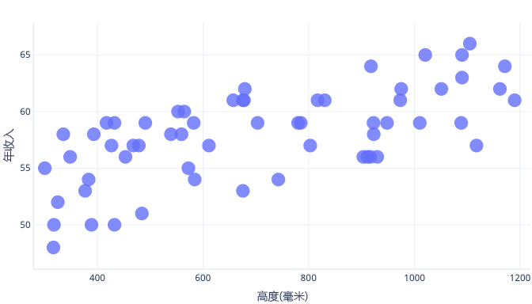
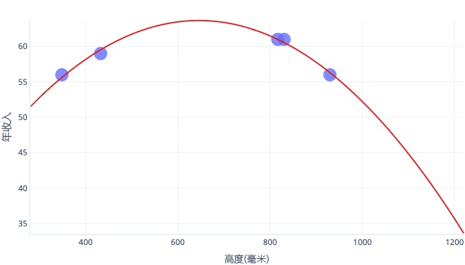
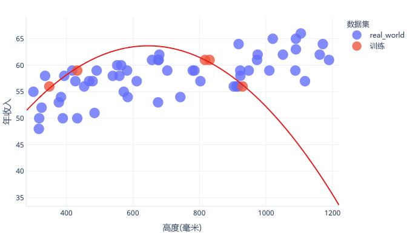
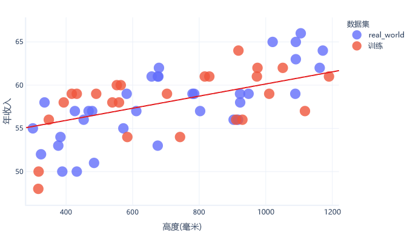

### 评估模型
准确度：(TP+TN)/(TP+TN+FP+FN) - 在所有预测中，有多少是正确的？
召回率：TP/(TP+FN) - 在所有为阳性的用例中，模型识别出了其中的多少个？
精准率：TP/(TP+FP) - 在模型预测为阳性的所有用例中，实际上有多少是阳性的？

### 过度拟合
用于训练模型的数据通常称为“训练数据集”。 我们已经实际了解这一点。 令人沮丧的是，当我们在现实世界中使用模型时，在训练模型后，我们并不确定它的表现如何。 这种不确定性是因为我们的训练数据集可能不同于现实世界中的数据。
#### 什么是过度拟合？
如果模型在训练数据方面的表现优于其他数据，则模型过度拟合。 这个说法指的是，模型拟合良好，以至于它能记住训练集的详细信息，而不是寻找适用于其他数据的广泛规则。 过度拟合很常见，但不可取。 在一天结束时，我们只关心模型在实际数据上的工作情况。
### 那么如何才能避免过度拟合？
我们可以通过多种方法避免过度拟合。 最简单的方法就是使用更简单的模型，或者使用数据集来更好地表示现实世界中所见的内容。 若要了解这些方法，来看一个场景，其中实际数据如下所示：

假设我们只收集了五只狗的信息，并将其用作训练数据集来拟合一条复杂的线。 如果能够这样做，就可以很好地拟合：

但是，当实际使用此图表时，我们发现它给出的预测是错误的：

如果我们有一个更具代表性的数据集和更简单的模型，则拟合的线可以改善预测（尽管并不完美）预测：

避免过度拟合的一种免费方法是在模型学习了常规规则之后，但在模型过度拟合之前，停止训练。 但是，这需要检测何时开始过度拟合模型。 为此，可以使用“测试数据集”。
#### 什么是测试数据集？
测试数据集（也称为“验证数据集”）是一组类似于训练数据集的数据。 事实上，测试数据集通常是通过采用大型数据集并拆分它而创建的。 一部分称为“训练数据集”，另一部分称为“测试数据集”。
训练数据集的工作是训练模型；我们已经看到了训练。 测试数据集的工作是检查模型的工作情况；它不直接参与训练。
### 好吧，但意义是什么？
测试数据集的意义有两个方面。
首先，如果测试性能在训练期间停止改进，我们可以停止，没有必要继续。 如果继续操作，最终就会鼓励模型学习有关不在测试数据集中的训练数据集的详细信息，这就是过度拟合。
其次，我们可以在训练后使用测试数据集。 这可以向我们指明最终模型在看到此前未看到的“真实”数据时的工作情况。
### 对于成本函数，这意味着什么？
当我们同时使用训练数据集和测试数据集时，最终会计算两个成本函数。
第一个成本函数使用训练数据集，就像之前看到的那样。 此成本函数将提供给优化器并用于训练模型。
第二个成本函数是使用测试数据集计算的。 我们使用它来检查模型在现实世界中的工作情况。 成本函数的结果不用于训练模型。 为了计算结果，我们将暂停训练，查看模型在测试数据集方面的表现，然后继续训练。


### 维持方法
维持方法与训练和测试类似，但它不会将一个数据集拆分为两个数据集，而是拆分为三个：训练数据集、测试（也称为“验证”）数据集和维持数据集。训练数据集和测试数据集就像我们前面所述的那样。 维持数据集是一种仅供使用一次的测试集，当我们准备好部署模型供实际使用时，会使用它。 换句话说，直到我们完成不同类型的训练方案、不同类型的模型等试验后，才会使用维持数据集。
此方法解决了我们通常使用不同的模型和训练方案进行试验的事实情况。 例如，我们拟合一个模型，发现它处理测试数据集的效果不佳，就需要更改正在训练的模型的某些方面，然后重试，直到我们获得一个好的结果。 这意味着我们要有目的地更改模型，以便适应一组特定数据，就像常规训练对训练数据集所做的那样。 通过这样做，最终可以获得一个模型，它基本上训练过度，无法处理测试数据集。
第三个数据集的思路是，我们也可以对其进行测试。 此方法就是通过三种方式拆分数据，这意味着我们从更少的训练数据开始。 如果没有大量数据需要处理，则此方法会降低我们获得良好模型的能力。

### 统计方法
源自统计信息的更简单的模型通常不需要测试数据集。 相反，我们可以直接将模型过度拟合的程度计算出统计学意义：“p 值”。
这些统计方法是功能强大且成熟的，构成了现代科学的基础。 优点是在任何情况下都不需要拆分训练集，我们可以更精确地了解我们对模型的信心。 例如，p 值 0.01 表示模型发现现实世界中一个并不存在的关系的可能性很小。 相比之下，p 值 0.5 意味着，虽然模型对于训练数据可能看起来还不错，但它并没有比在现实世界中抛硬币决定好多少。
这些方法的缺点是它们只能轻松应用于某些模型类型，比如我们一直在练习的线性回归模型。 对于除了最简单的模型之外的所有模型，这些计算可能非常复杂，难以正确执行，因此不在本课程介绍的范畴内。 它们还在数据选择方面受到相同的限制；如果训练数据存在偏差，则 p 值将具有误导性。

### 误差
```
R2（R 平方）（有时称为确定系数）是 x 和 y 平方之间的相关性。 这会生成一个介于 0 和 1 之间的值，该值可测量模型可以解释的方差量。 通常，此值越接近 1，模型的预测效果就越好。
```

### loss 损失
回归预测模型常见的评估误差指标有以下几种：
```
MAE，平均绝对误差，Mean absolute error，预测值与真实值的绝对误差的平均值
MedianAE，绝对误差中位数，Median absolute error，预测值与真实值的绝对误差的中位数，对目标变量异常值很健壮。
MSE，均方误差，Mean squared error，预测值与真实值的绝对平方误差的平均值
RMSE，均方根误差，MSE的平方根
MSLE，均方对数误差
RMSLE，均方根对数误差，MSLE的平方根
MAPE，平均绝对百分比误差，Mean absolute percentage error，此指标对相对误差敏感，不会因目标变量的全局缩放而改变，适合目标变量量纲差距较大的问题。
MedianAPE，绝对百分比误差中位数，Median absolute percentage error，同样适合目标变量量纲差距较大的场景，并且异常值比MAPE健壮。
```


常规场景下，使用mae，mse，mape基本能满足，但是有些特殊场景需要选择最适合的评估指标或者评估策略。
例如我们预测10个数据，来观测预测值与真实值的各种误差指标
```
import pandas as pd
import numpy as np
import sklearn
from sklearn.metrics import mean_squared_error
from sklearn.metrics import mean_absolute_error
from sklearn.metrics import mean_absolute_percentage_error
from sklearn.metrics import median_absolute_error
from sklearn.metrics import mean_squared_log_error
```
```
def median_absolute_percentage_error(y_true,y_pred):
    return np.median(np.abs((y_pred-y_true)/y_true))
def regression_metrics(true,pred):
    print('回归模型评估指标结果:')
    print('均方对数误差【MSLE】:',mean_squared_log_error(true,pred))
    print('均方根对数误差【RMSLE】:',np.sqrt(mean_squared_log_error(true,pred)))
    print('均方误差【MSE】:', mean_squared_error(true, pred))
    print('均方根误差【RMSE】:',np.sqrt(mean_squared_error(true,pred)))
    print('平均绝对误差【MAE】:',mean_absolute_error(true,pred))
    print('平均绝对百分比误差【MAPE】:',mean_absolute_percentage_error(true,pred))
    print('绝对误差中位数【MedianAE】:',median_absolute_error(true,pred))
    print('绝对百分比误差中位数【MedianAPE】:',median_absolute_percentage_error(true,pred))
```
1、同样误差下，期望预测值大于真实值的
```
例如10个数中，只有最后一个数据预测有误差，一个是少预测了20000，一个是多预测了20000
true=np.array([5,100,5,100,5,100,5,100,5,100000])
pred1=np.array([5,100,5,100,5,100,5,100,5,80000])
print('第一组：')
regression_metrics(true,pred1)
pred2=np.array([5,100,5,100,5,100,5,100,5,120000])
print('第二组：')
regression_metrics(true,pred2)
```

这个案例中，只有MSLE和RMSLE有区别，其他误差指标肯定都是一样的。但是发现，MSLE对预测值小于真实值的惩罚要大一些，这种指标就比较适合应用在预测必需品的投放量这种场景，同样误差的时候，预测多了比预测少了要优先。
### 目标变量的量纲差距过大场景
例如10个数据，一种是每个都多预测了20%，另一种是前9个数都多预测了100%，最后一个大数预测准确。
```
true=np.array([5,100,5,100,5,100,5,100,5,100000])
pred1=np.array([6,120,6,120,6,120,6,120,6,120000])
print('第一组：')
regression_metrics(true,pred1)
pred2=np.array([10,200,10,200,10,200,10,200,10,100000])
print('第二组：')
regression_metrics(true,pred2)
```

这个案例中，如果我们期望第一种是较优模型。那么使用mse，mae这种绝对误差就会有风险。应该使用mape等百分比误差。并且中位数类的指标更健壮。

总之，要根据实际工程场景，确定模型的评估指标或评估策略。